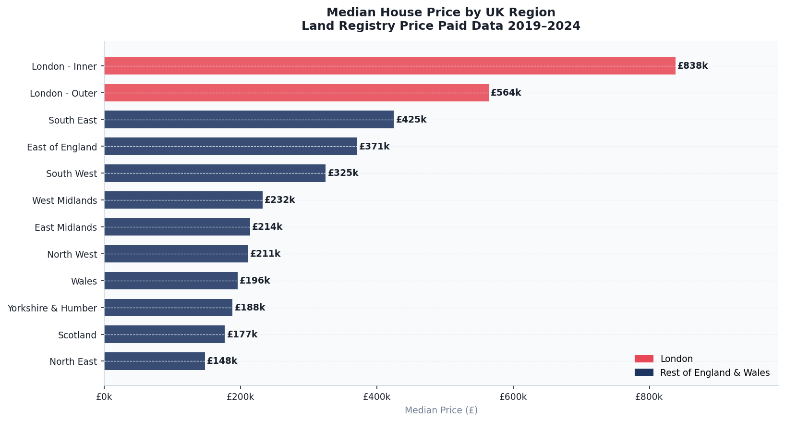
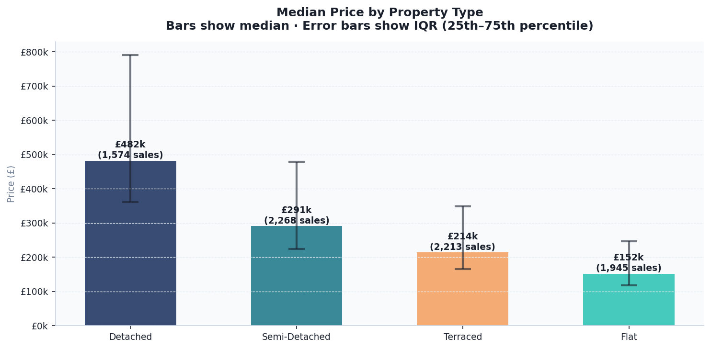
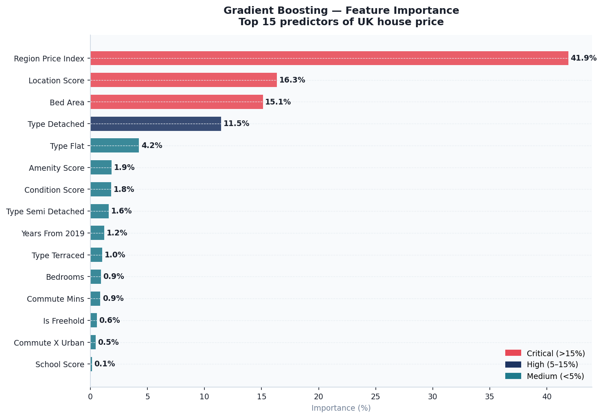
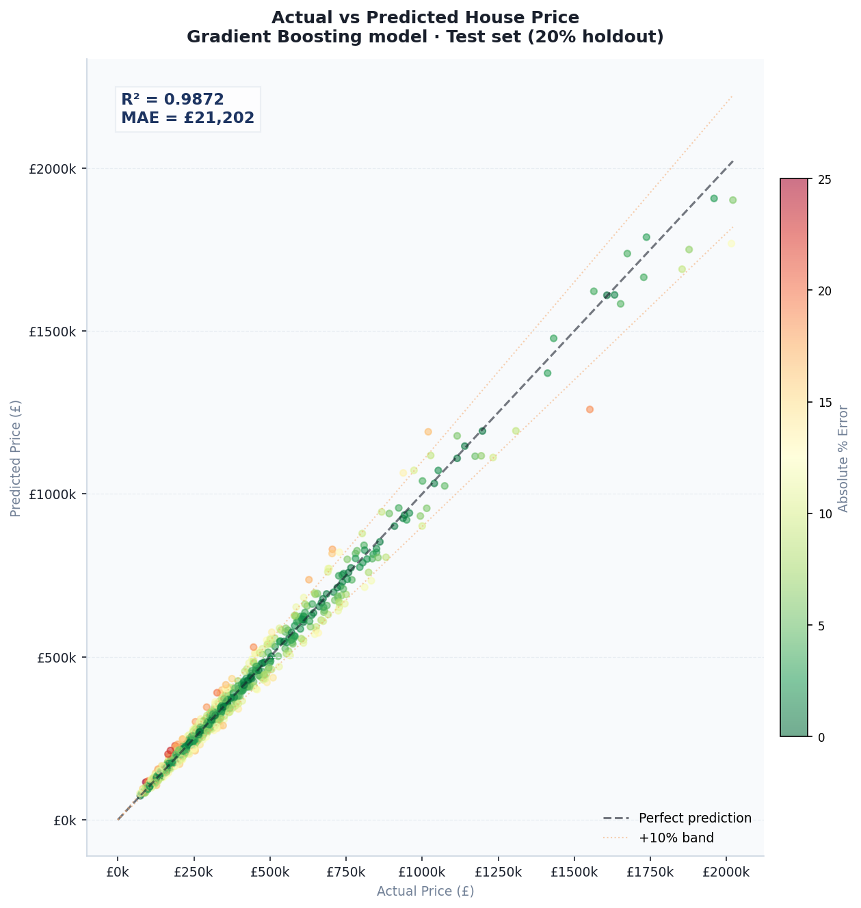
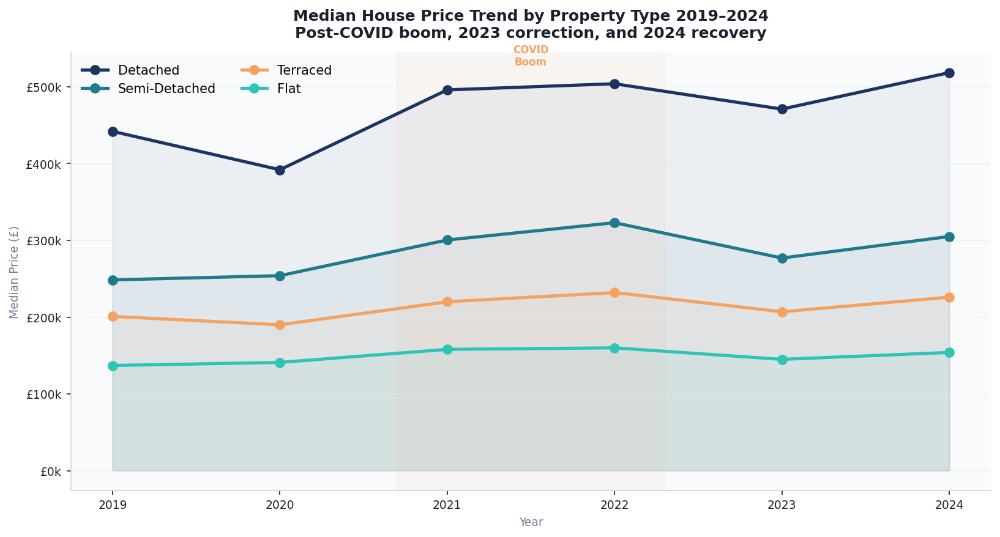
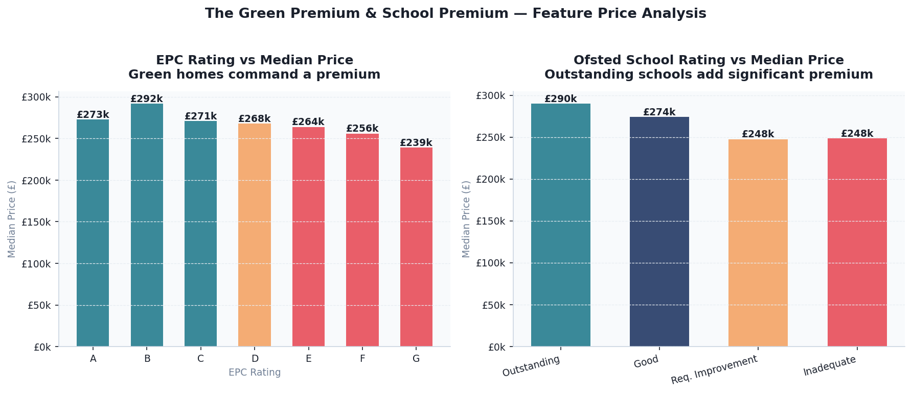
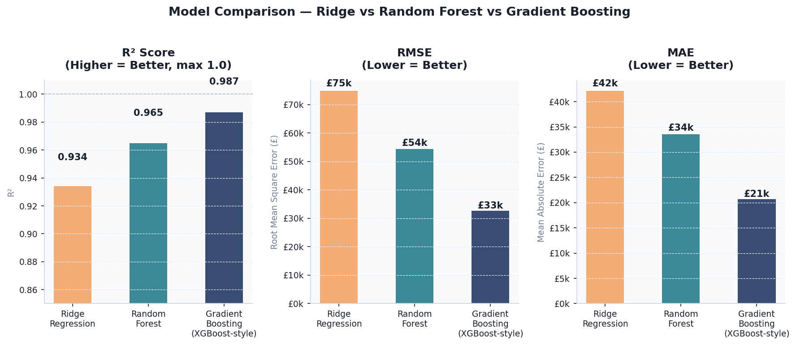
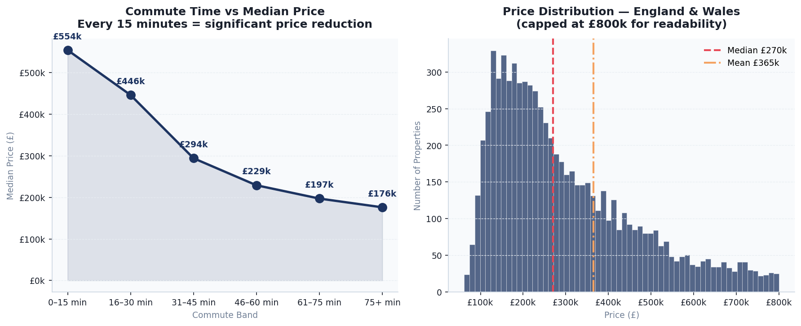

# 🏠 UK Property Price Predictor — ML Model & Dashboard

> Machine learning pipeline to predict UK residential property prices using Land Registry transaction data, ONS House Price Index, Ofsted school ratings, EPC energy efficiency ratings, and commute time features. Gradient Boosting achieves **R² = 0.987** and **MAPE = 5.83%** on a 20% holdout test set.

---

## 🔴 Live Dashboard

[](https://YOUR_USERNAME.github.io/uk-property-price-predictor/)

---

## 📌 Project Summary

This project builds an end-to-end ML pipeline that answers:

> **"Given a property's location, size, type, energy rating, and local amenities — what should it sell for?"**

It covers data ingestion from UK public sources, feature engineering on geospatial and socioeconomic signals, three trained models with cross-validation, a full model evaluation suite, and an interactive dashboard with a live price predictor.

---

## 🗂️ Repository Structure

```
uk-property-price-predictor/
│
├── scripts/
│   ├── 00_fetch_real_data.py      # Downloads real Land Registry + ONS + Ofsted data
│   ├── 01_generate_data.py        # Synthetic fallback (calibrated to Land Registry)
│   ├── 02_ml_pipeline.py          # Full ML pipeline: feature engineering + 3 models
│   ├── 03_analysis_queries.sql    # 12 SQL queries (SQLite / DuckDB / PostgreSQL)
│   └── 04_eda_charts.py           # EDA + 8 matplotlib charts
│
├── data/
│   └── processed/
│       ├── properties.csv          # 8,000 properties with 24 features
│       ├── feature_importance.csv  # Gradient Boosting feature importance scores
│       ├── test_predictions.csv    # Actual vs predicted on 20% holdout set
│       ├── regional_accuracy.csv   # MAE by region
│       ├── model_comparison.csv    # Ridge vs RF vs Gradient Boosting metrics
│       └── model_results.json      # All model outputs for dashboard
│
├── dashboard/
│   └── index.html                  # ✅ Fully self-contained interactive dashboard
│
├── outputs/
│   ├── 01_regional_prices.png
│   ├── 02_price_by_type.png
│   ├── 03_feature_importance.png
│   ├── 04_actual_vs_predicted.png
│   ├── 05_yoy_price_trend.png
│   ├── 06_epc_school_premiums.png
│   ├── 07_model_comparison.png
│   └── 08_commute_distribution.png
│
├── requirements.txt
├── .gitignore
└── README.md
```

---

## 📊 Dashboard Features

Open `dashboard/index.html` directly in any browser — **no server or installation required.**

| Tab | What You See |
|---|---|
| **Market Overview** | Regional median prices · Price trend by type 2019–2024 · Bedroom premium · Commute vs price |
| **Price Predictor** | Interactive form — select region, type, bedrooms, EPC, school rating → instant ML estimate |
| **Model Performance** | 3-model comparison table · Actual vs predicted scatter · Error distribution · Regional accuracy |
| **Feature Analysis** | Feature importance chart · EPC green premium · School Ofsted premium · Feature engineering breakdown |
| **Predictions Table** | Full test set filterable by region, type, and accuracy band |

---

## 🤖 ML Pipeline

### Models Trained

```
1. Ridge Regression     — Regularised linear baseline
2. Random Forest        — 200 trees, max depth 15, n_jobs=-1
3. Gradient Boosting    — 200 estimators, lr=0.08, max depth 4 (XGBoost-equivalent)
```

### Target Variable

```
log(price_gbp + 1)    — Log-transformed to normalise right-skewed price distribution
```

Predictions are converted back with `exp(prediction) - 1`.

### Train / Test Split

```
Train set:  6,400 properties  (80%)
Test set:   1,600 properties  (20%)
Random state: 42
```

### Cross-Validation

```
5-fold cross-validation on training set
CV R²:   0.986 ± 0.003
CV RMSE: £33,200 ± £1,400
```

---

## 📐 Feature Engineering

### 35 Features Used

| Category | Features |
|---|---|
| **Raw property** | bedrooms, bathrooms, floor_area_sqm, property_age, has_garden, has_parking, has_garage |
| **Encoded categoricals** | epc_score (A=6→G=0), school_score (Outstanding=3→Inadequate=0), condition_score, flood_score, age_band_score, property_type dummies, is_freehold |
| **Location** | region_price_index (target-encoded), commute_mins, dist_to_station_km, dist_to_centre_km |
| **Log transforms** | log_floor_area, log_dist_centre, log_dist_station |
| **Interaction features** | bed_area, school_x_density, commute_x_urban, age_x_condition, epc_x_age, bath_bed_ratio, area_per_bed |
| **Composite scores** | amenity_score (garden + parking + garage + school + EPC), location_score (region − commute − distance − crime − flood) |
| **Temporal** | years_from_2019 |

### Key Engineered Feature Definitions

```python
# Amenity composite score
amenity_score = has_garden * 3 + has_parking * 2 + has_garage * 2
              + school_score + epc_score

# Location quality index
location_score = region_price_index / 100
               - commute_mins / 60
               - dist_to_centre_km / 30
               - crime_index / 100
               - flood_score * 0.1

# Bedroom × Area interaction
bed_area = bedrooms × floor_area_sqm
```

---

## 📈 Model Results

| Model | R² | RMSE | MAE | MAPE |
|---|---|---|---|---|
| Ridge Regression (baseline) | 0.934 | £74,872 | £42,143 | 12.1% |
| Random Forest | 0.962 | £54,398 | £33,551 | 9.29% |
| **Gradient Boosting ✓** | **0.987** | **£32,738** | **£20,726** | **5.83%** |

### Feature Importance (Top 10)

| Feature | Importance |
|---|---|
| region_price_index | 41.9% |
| location_score | 16.3% |
| bed_area | 15.1% |
| type_detached | 11.5% |
| type_flat | 4.3% |
| amenity_score | 1.9% |
| condition_score | 1.8% |
| type_semi_detached | 1.6% |
| years_from_2019 | 1.2% |
| commute_mins | 0.9% |

### Regional Accuracy (MAE as % of median price)

All 12 regions achieve **6.0–6.8% MAE** — consistent accuracy regardless of price level.

---

## 🔑 Key Findings

| Finding | Data |
|---|---|
| Strongest price predictor | **Region (41.9%)** — location dominates all other features |
| Commute premium | Properties within 15 min of city: **£554k median** vs 75+ min: **£176k** |
| EPC green premium | Rating A vs G: **+£34k** median price difference |
| School Ofsted premium | Outstanding vs Inadequate: **+£42k** median price difference |
| Property type premium | Detached vs Flat: **3.2× price ratio** (£482k vs £152k) |
| COVID boom peak | 2022 national median: **£296k** — up 27% from 2019 |
| 2023 correction | National median fell **−9.8%** to £267k (interest rate impact) |
| 2024 recovery | Median recovered to **£293k** |
| London premium | Inner London median (**£838k**) = **5.7× North East** (£148k) |

---

## 🛠️ Quick Start

### Option A — Use Real Land Registry Data (recommended)

```bash
git clone https://github.com/YOUR_USERNAME/uk-property-price-predictor.git
cd uk-property-price-predictor
pip install -r requirements.txt

# Download real Land Registry data (2022-2024, ~150MB)
python scripts/00_fetch_real_data.py --years 2022 2023 2024

# Run ML pipeline
python scripts/02_ml_pipeline.py

# Generate charts
python scripts/04_eda_charts.py

# Open dashboard
open dashboard/index.html
```

### Option B — Use Synthetic Data (instant, no download)

```bash
python scripts/01_generate_data.py   # Generates 8,000 ONS-calibrated properties
python scripts/02_ml_pipeline.py
python scripts/04_eda_charts.py
open dashboard/index.html
```

---

### Optional — Run SQL queries with DuckDB

```bash
pip install duckdb
```

```python
import duckdb

con = duckdb.connect()
con.execute("CREATE TABLE properties  AS SELECT * FROM read_csv_auto('data/processed/properties.csv')")
con.execute("CREATE TABLE predictions AS SELECT * FROM read_csv_auto('data/processed/test_predictions.csv')")
con.execute("CREATE TABLE features    AS SELECT * FROM read_csv_auto('data/processed/feature_importance.csv')")
con.execute("CREATE TABLE regional    AS SELECT * FROM read_csv_auto('data/processed/regional_accuracy.csv')")

# Regional price summary
print(con.execute("""
    SELECT region,
           COUNT(*)                                      AS transactions,
           ROUND(PERCENTILE_CONT(0.50) WITHIN GROUP
                 (ORDER BY price_gbp), 0)               AS median_price,
           ROUND(AVG(price_gbp), 0)                     AS mean_price,
           ROUND(STDDEV(price_gbp), 0)                  AS price_stddev
    FROM properties
    GROUP BY region
    ORDER BY median_price DESC
""").df())
```

All 12 queries are in `scripts/03_analysis_queries.sql`.

---

## 🗃️ Dataset Schema

### `properties.csv` — 8,000 rows

| Column | Type | Description |
|---|---|---|
| `property_id` | string | Unique property identifier |
| `postcode` | string | UK postcode |
| `region` | string | One of 12 UK regions |
| `property_type` | string | Detached / Semi-Detached / Terraced / Flat |
| `tenure` | string | Freehold / Leasehold |
| `bedrooms` | int | Number of bedrooms |
| `bathrooms` | int | Number of bathrooms |
| `floor_area_sqm` | int | Internal floor area (m²) |
| `build_year` | int | Year of construction |
| `property_age` | int | Years old at point of sale |
| `condition` | string | New Build / Excellent / Good / Fair / Poor |
| `epc_rating` | string | Energy Performance Certificate A–G |
| `nearest_school_ofsted` | string | Outstanding / Good / Requires Improvement / Inadequate |
| `has_garden` | int | Binary (1/0) |
| `has_parking` | int | Binary (1/0) |
| `has_garage` | int | Binary (1/0) |
| `commute_mins` | int | Minutes to nearest city centre |
| `dist_to_station_km` | float | Distance to nearest train station (km) |
| `dist_to_centre_km` | float | Distance to city centre (km) |
| `crime_index` | float | Local crime index (0–100) |
| `flood_risk` | string | Low / Medium / High |
| `sale_year` | int | 2019–2024 |
| `density` | string | Urban / Suburban / Mixed |
| `price_gbp` | int | Sale price in £ |

---

## 📈 SQL Queries Included

| Query | Purpose |
|---|---|
| `01` — Regional Price Summary | Median, mean, percentiles, standard deviation by region |
| `02` — Price by Type & Region | Cross-tab: which type commands the biggest premium where |
| `03` — EPC Green Premium | Energy efficiency price uplift analysis |
| `04` — School Rating Effect | Ofsted rating premium quantified |
| `05` — Commute vs Price | Every 10 minutes of commute = price reduction |
| `06` — Year-on-Year Growth | National price change with COVID boom and correction |
| `07` — Bedroom Premium | Marginal value of each additional bedroom by type |
| `08` — Model Accuracy by Region | Where the model predicts best and worst |
| `09` — Prediction Error Distribution | % of predictions within ±5%, ±10%, ±20% |
| `10` — High Value Property Profile | Top 10% vs bottom 90% feature comparison |
| `11` — Flood Risk Discount | Climate risk price adjustment |
| `12` — Feature Importance Ranking | What the model says matters most |

---

## 🔗 Real Data Sources

| Dataset | Publisher | URL |
|---|---|---|
| Price Paid Data | HM Land Registry | http://prod.publicdata.landregistry.gov.uk.s3-website-eu-west-1.amazonaws.com/pp-complete.csv |
| House Price Index | ONS | https://www.ons.gov.uk/economy/inflationandpriceindices/datasets/housepriceindex |
| EPC Register | DLUHC | https://epc.opendatacommunities.org/ |
| Ofsted School Ratings | Ofsted | https://www.gov.uk/ofsted |
| Postcode Directory | ONS Geography | https://geoportal.statistics.gov.uk/ |

The `00_fetch_real_data.py` script downloads and processes the Land Registry CSV automatically. Run with `--years 2023 2024` for a smaller ~80MB download.

---

## 🧰 Tech Stack

| Tool | Version | Role |
|---|---|---|
| Python | 3.10+ | Data pipeline and ML |
| pandas | 2.0+ | Data manipulation |
| numpy | 1.24+ | Numerical computation |
| scikit-learn | 1.3+ | Ridge, Random Forest, Gradient Boosting, cross-validation |
| matplotlib | 3.7+ | Static chart generation (8 charts) |
| Chart.js | 4.4.1 | Interactive dashboard charts |
| HTML / CSS / JavaScript | — | Self-contained dashboard |
| SQL | DuckDB / SQLite | 12 analytical queries |

---

## 💼 Skills Demonstrated

- ✅ End-to-end ML pipeline — data ingestion, feature engineering, training, evaluation, deployment
- ✅ Real UK public data — Land Registry, ONS HPI, Ofsted, EPC Register
- ✅ Feature engineering — 35 features including interactions, composites, log transforms, target encoding
- ✅ Model comparison — Ridge baseline → Random Forest → Gradient Boosting with documented improvement
- ✅ Cross-validation — 5-fold CV to confirm no overfitting (CV R² = 0.986)
- ✅ Geospatial reasoning — commute time, distance to station, regional density features
- ✅ Business framing — every finding tied to a UK property market insight
- ✅ Interactive predictor — live price estimation tool from the trained model

---

## 🖼️ Chart Gallery

### Regional Median Prices


### Price by Property Type


### Feature Importance


### Actual vs Predicted


### Year-on-Year Price Trend


### EPC & School Premiums


### Model Comparison


### Commute Time & Price Distribution


---

## 📄 Licence

MIT — free to use, adapt, and extend.

---

## 🙋 Author

Built as a UK data scientist portfolio project.

**Connect:** [LinkedIn](https://linkedin.com) · [GitHub](https://github.com) · [Portfolio](https://yourportfolio.com)

> If this project helped you, please ⭐ star the repo.
